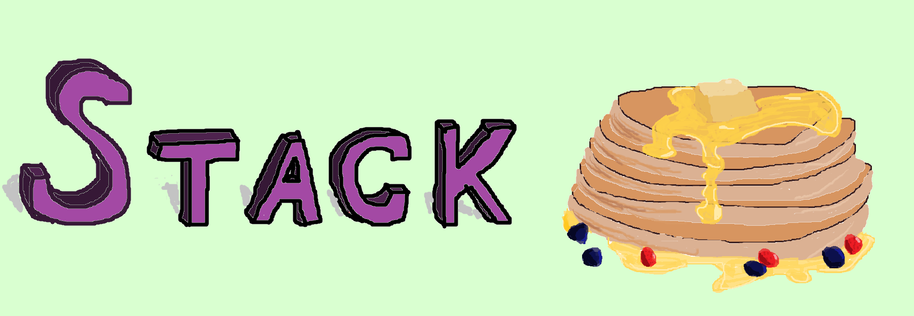

# Stack

## Program Purpose

This is my version of stack data structure. Also interactive user interface was realized in this program.

## Realized functions

This program supports following stack functions:
- stack_ctor()
- stack_dtor()
- stack_push()
- stack_pop()
- stack_dump()

## Realized protection

This version of stack data structure supporting following types of protection:
- Canary protection.
- Hash protection.

## Installation:

Bend the repository and compile the files

First step:
~~~
git clone https://github.com/R0flan4k/Stack.git
~~~

Second step:
~~~
cd src
~~~

Third step:
~~~
make
~~~
